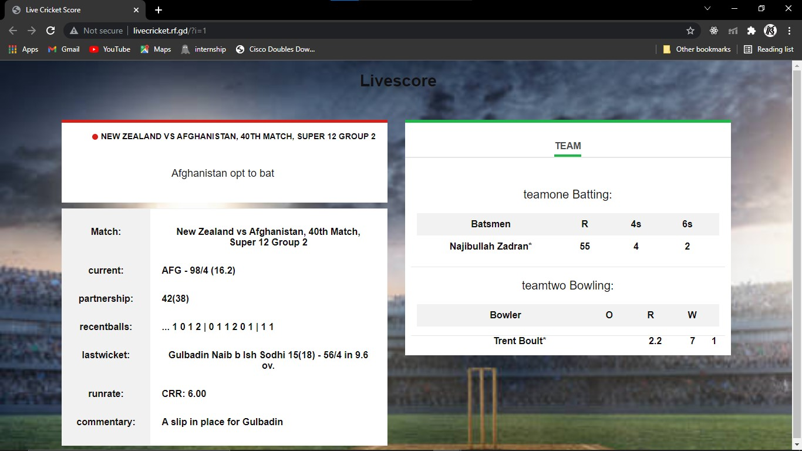

# Live-Cricket-Score
Checkout here (http://livecricket.rf.gd/)
Basically Its a webpage that fetches data with help of PHP arrays and displays live cricket score .Fetches data using API.

## Technologies Used
1. [infinityfree.net](https://app.infinityfree.net/) One of those websites which provides free domainname,hosting and probably SSL certificates too & i hosted the webpage here.Also the fact that made me host it here is my index file was in .php format and which most of hosting services dont allow it, whereas infinityfree did.

2. Programming Languages used: HTML,CSS,JS,PHP

3. [XAMPP]: It works like an localhost which is basically used to store and test our code.

## Output

 
## Make sure to do following changes in index.php file
```
  $data=file_get_contents('https://cricket-api.vercel.app/cri.php?url=https://www.cricbuzz.com/live-cricket-scores/38137/40th-match-super-12-group-2-icc-mens-t20-world-cup-2021');

//change the link provided after keyword 'url' that is visit cricbuzz website check live match going on cricbuzz and paste it after after keyword 'url'.


